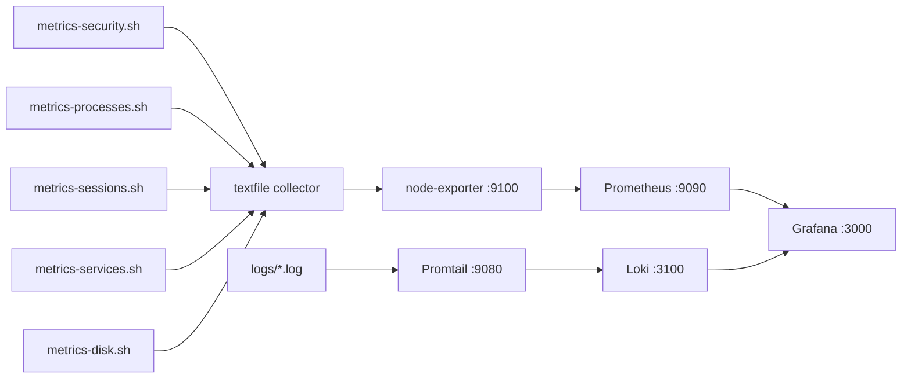

# System dashboard

Live system health via Prometheus + Loki → Grafana. Covers the metric pipeline, dashboard panels, alert rules, and operational reference.

---

## Metric pipeline



| Script | Output file | Fires at | Reason |
|---|---|---|---|
| `metrics-security.sh` | `security.prom` | `:00` each minute | Auth log counters are slow-moving |
| `metrics-processes.sh` | `processes.prom` | `:10` and `:40` each minute | CPU and RSS change at subsecond scale |
| `metrics-sessions.sh` | `sessions.prom` | `:15` and `:45` each minute | SSH sessions need near-realtime visibility |
| `metrics-disk.sh` | `disk-dirs.prom` | `:20` of every 5th minute | `du` walks entire directory trees — I/O heavy |
| `metrics-services.sh` | `services.prom` | `:30` each minute | Service state is polled, not event-driven |

Timers are staggered by second offset so no two collectors fire simultaneously.

All five write Prometheus textfiles to `/var/lib/prometheus/node-exporter/`. node-exporter exposes them; Prometheus scrapes node-exporter. Script logs are tailed by Promtail and shipped to Loki.

`nizam_service_up` carries a `source="dotfiles"` label to distinguish it from the same metric written by nizam-os. Grafana queries filter on this label.

---

## Dashboard import

Grafana, Prometheus, Loki, and Promtail are installed by [RUNBOOK → Machine setup](RUNBOOK.md#machine-setup-fresh-vps). Once running:

1. Connections → Data Sources → Add → **Prometheus** — URL: `http://localhost:9090`, UID: `nizam-prometheus` → Save & Test
2. Connections → Data Sources → Add → **Loki** — URL: `http://localhost:3100`, UID: `nizam-loki` → Save & Test
3. Push the dashboard:

```bash
bash scripts/grafana/push-dashboard.sh grafana/001-system-dashboard.json
```

---

## Grafana scripts

Two utility scripts for syncing dashboards between the repo and Grafana. Both read `GRAFANA_URL` and `GRAFANA_AUTH` from `secrets/nizam-dotfiles.env`, with `http://localhost:3000` / `admin:admin` as fallback defaults.

```bash
# push local JSON to Grafana
bash scripts/grafana/push-dashboard.sh grafana/001-system-dashboard.json

# pull from Grafana by UID (find UID in the dashboard URL: /d/<uid>/...)
bash scripts/grafana/pull-dashboard.sh <uid> grafana/001-system-dashboard.json
```

After pulling, commit the updated JSON to keep the repo in sync.

---

## Dashboard panels

### Stat tiles

Seven tiles giving a live snapshot. Color thresholds: green (normal), orange (warning), red (critical).

| Tile | Metric | Thresholds |
|---|---|---|
| Uptime | Time since last boot | — |
| CPU Usage | % CPU in use | Orange >70%, red >90% |
| RAM Usage | % RAM used | Orange >75%, red >90% |
| Disk Usage | % of root partition used | Orange >70%, red >90% |
| Load Avg (1m) | Processes waiting to run | Red >2.0 on a 2-core VPS |
| TCP Connections | Active TCP connections | — |
| Services | % of tracked services currently active | Red <100% |

An unexpected uptime reset means the server rebooted. A full root partition silently crashes services that attempt writes.

### CPU & memory

Time series over the last 6 hours.

- **CPU** — one line per core. One core pinned at 100% with others idle indicates a single-threaded bottleneck.
- **Memory** — three lines: used (red), cache/buffer (yellow — freely reclaimed by the kernel), available (green). Available shrinking continuously without recovery indicates a memory leak.

### Network & disk I/O

Mirrored layout: positive = inbound/read, negative = outbound/write.

- **Network** — bytes/s in and out. Sustained unexpected inbound traffic warrants investigation.
- **Disk** — bytes/s read and written. Sustained unexplained writes indicate runaway logging or an uncontrolled database process.

### Load average + disk usage by directory

- **Load avg** — 1m (yellow), 5m (orange), 15m (red). All three rising together indicates sustained pressure. A 1m spike with 5m/15m flat is a short burst, typically a cron job.
- **Disk usage by directory** — top 5 directories stacked as a single bar against the total disk. Each segment is a directory path; hover for exact size. Updated every 5 min. `/var/lib` = database data, `/var/log` = logs, `/var/cache` = apt cache.

### Top processes

Two bar gauges showing top 5 consumers, updated every 30 seconds.

- **Top CPU** — `%CPU` per process from `ps aux`. Process name includes PID (`grafana[892]`) so multiple instances of the same binary appear separately.
- **Top memory** — RSS per process proportional to total server RAM. Python and Node processes show their parent directory (`litellm/python`, `hermes-agent/python`) to distinguish multiple instances of the same binary.

Both panels use instant queries to avoid range queries returning >5 series when different processes enter the top 5 at different timestamps. `du`, `ps`, `awk`, `grep`, `sh`, and `bash` are excluded — they appear briefly at 100% CPU during collection and carry no diagnostic signal.

### Security & availability tiles

All-time counters except Currently Banned and Active SSH Sessions, which reflect live state. Availability reflects rolling 7d uptime — can be below 100% even if all services are currently up.

| Tile | Metric |
|---|---|
| SSH Failed Logins | Total failed password attempts in `auth.log` |
| SSH Invalid Users | Attempts using non-existent usernames |
| Currently Banned | IPs currently blocked by fail2ban |
| UFW Blocked Packets | Total packets dropped by the firewall |
| Active SSH Sessions | Count of currently active SSH sessions; alert fires at >1 |
| Availability (7d) | Rolling 7d uptime across all tracked services |

High totals on a public-facing VPS are expected noise. Currently Banned rises and falls as bans expire.

### SSH session history

Table of SSH sessions over a 24 hour window — Prometheus returns the maximum value seen in the last 24 hours for each session label set. This means rows survive disconnect: the Duration column freezes at the final session length when the session ends, and disappears 24 hours later.

### Service up/down

State timeline per service — gaps are immediately visible. Shows only dotfiles-layer services (`source="dotfiles"`).

### Security events timeline

Shows the **1-hour increase** in each security counter — converts flat all-time totals into activity spikes. A coordinated spike across SSH failures and UFW blocks indicates an active scan or brute-force attempt. fail2ban responds automatically; this panel shows that it happened.

### Logs

- **Log volume by level** — Stacked bar chart. One stack per level, colored by severity: INFO (green), WARNING (orange), ERROR (red). Shows INFO/WARNING/ERROR distribution over time. Filter by `script` label to isolate a specific script.
- **Log stream** — Live tail of all script output, pretty-printed JSON with colored level badge.

---

## Datasources

| Datasource | URL | UID |
|---|---|---|
| Prometheus | `http://localhost:9090` | `nizam-prometheus` |
| Loki | `http://localhost:3100` | `nizam-loki` |

---

## Alerts

Unified alerting via Grafana → Discord. Two severity levels, two contact points.

### Contact points

| Name | Env var | Routes |
|---|---|---|
| `nizam-warn` | `DISCORD_WEBHOOK_WARNING` | `severity=warning` |
| `nizam-crit` | `DISCORD_WEBHOOK_CRITICAL` | `severity=critical` |

Webhooks are read from `secrets/nizam-dotfiles.env` at run time.

### Alert message format

Discord messages use a compact custom template (`nizam-discord`), pushed by `setup-alerts.sh`:

```
[CRITICAL] CPU High Critical
CPU usage is above 90% | value: 94.2
Firing since: Jul 8 18:04 UTC

Dashboard: http://localhost:3000/d/nizam-system
```

Multiple alerts firing at once are listed sequentially above the dashboard link.

### Setup via script (recommended)

```bash
cp ~/nizam-dotfiles/secrets/nizam-dotfiles.env.example ~/nizam-dotfiles/secrets/nizam-dotfiles.env
# fill secrets
bash ~/nizam-dotfiles/scripts/setup/setup-grafana.sh
bash ~/nizam-dotfiles/scripts/setup/setup-alerts.sh
```

`setup-grafana.sh` provisions datasources (`nizam-prometheus`, `nizam-loki`) and pushes the dashboard — run it first. Both scripts are idempotent and safe to re-run. `setup-alerts.sh` deletes and recreates all rules in the `nizam-system` group on each run.

### Setup via Grafana UI

**1. Contact points**

Alerting → Contact points → + Add contact point

| Field | `nizam-warn` | `nizam-crit` |
|---|---|---|
| Name | `nizam-warn` | `nizam-crit` |
| Integration | Discord | Discord |
| Webhook URL | `DISCORD_WEBHOOK_WARNING` value | `DISCORD_WEBHOOK_CRITICAL` value |

Save each. Test with the Test button.

**2. Notification policy**

Alerting → Notification policies → Edit root policy → Default receiver: `nizam-crit`

Add two nested policies under root:

| Matcher | Receiver | Group wait | Repeat interval |
|---|---|---|---|
| `severity = warning` | `nizam-warn` | 30s | 4h |
| `severity = critical` | `nizam-crit` | 10s | 1h |

**3. Alert folder**

Dashboards → New → New folder → name: `nizam-alerts`

**4. Alert rules**

Alerting → Alert rules → + New alert rule. For each rule, set folder `nizam-alerts`, group `nizam-vps`, add label `severity=<value>`, set **For** duration, then define two query nodes:

- **A** — datasource `nizam-prometheus`, expression as shown, instant query
- **B** — datasource `-- Expression --`, type `Classic conditions`, input A, evaluator as shown

| Rule | Expression (A) | Evaluator (B) | Severity | For |
|---|---|---|---|---|
| CPU High Warning | `100 - (avg(rate(node_cpu_seconds_total{mode="idle"}[5m])) * 100)` | IS ABOVE 70 | warning | 5m |
| CPU High Critical | same as above | IS ABOVE 90 | critical | 5m |
| Memory High Warning | `(1 - (node_memory_MemAvailable_bytes / node_memory_MemTotal_bytes)) * 100` | IS ABOVE 75 | warning | 5m |
| Memory High Critical | same as above | IS ABOVE 90 | critical | 5m |
| Disk Full Warning | `(1 - (node_filesystem_avail_bytes{mountpoint="/"} / node_filesystem_size_bytes{mountpoint="/"})) * 100` | IS ABOVE 70 | warning | 1m |
| Disk Full Critical | same as above | IS ABOVE 90 | critical | 1m |
| Service Down | `min(nizam_service_up{source="dotfiles"})` | IS EQUAL TO 0 | critical | 2m |
| SSH Session Count | `nizam_ssh_active_sessions` | IS ABOVE 1 | critical | 30s |

### Routing

| Severity | Group wait | Repeat interval |
|---|---|---|
| warning | 30s | 4h |
| critical | 10s | 1h |

Critical fires immediately and repeats hourly until resolved. Warning batches within the group window.

### Alert rules

All rules live in folder `nizam-alerts`, group `nizam-vps`. Each threshold is a separate rule with a `severity` label — routing is driven entirely by that label.

| Rule | Warning | Critical | For |
|---|---|---|---|
| CPU High | >70% | >90% | 5m |
| RAM High | >75% | >90% | 5m |
| Disk Full | >70% | >90% | 1m |
| Service Down | — | any service inactive | 2m |
| SSH Session Count | — | >1 simultaneous | 30s |

### Managing alerts

**View rules:** Grafana → Alerting → Alert rules → folder `nizam-alerts`

**Silence an alert:** Grafana → Alerting → Silences → Add silence — set label matcher and duration

**Test a contact point:** Grafana → Alerting → Contact points → `nizam-warn` or `nizam-crit` → Test

**Update a threshold:** edit `scripts/setup/setup-alerts.sh`, re-run the script

---

## Operational reference

### Check collector status

```bash
sudo systemctl status metrics-security.timer metrics-processes.timer metrics-disk.timer metrics-sessions.timer metrics-dotfiles-services.timer --no-pager
```

Trigger manually and inspect output:

```bash
sudo systemctl start metrics-security.service && cat /var/lib/prometheus/node-exporter/security.prom
sudo systemctl start metrics-processes.service && cat /var/lib/prometheus/node-exporter/processes.prom
sudo systemctl start metrics-disk.service && cat /var/lib/prometheus/node-exporter/disk-dirs.prom
sudo systemctl start metrics-sessions.service && cat /var/lib/prometheus/node-exporter/sessions.prom
sudo systemctl start metrics-dotfiles-services.service && cat /var/lib/prometheus/node-exporter/services.prom
```

Confirm Prometheus is scraping:

```bash
curl -s http://localhost:9100/metrics | grep nizam_
```

Recent logs:

```bash
sudo journalctl -u metrics-security.service -n 10 --no-pager
sudo journalctl -u metrics-processes.service -n 10 --no-pager
sudo journalctl -u metrics-disk.service -n 10 --no-pager
```

### Script logs

All metric scripts write structured JSON to `~/nizam-dotfiles/logs/scripts.log` via `scripts/shared/_log.sh`.

Format: `{"ts":"...", "level":"INFO", "script":"script-name", "msg":"..."}`

When running a script manually in a terminal, output is colored: green for INFO, yellow for WARN, red for ERROR. When run by systemd (no TTY), plain JSON goes to stdout and is captured by the journal.

```bash
tail -f ~/nizam-dotfiles/logs/scripts.log
grep '"level":"ERROR"' ~/nizam-dotfiles/logs/scripts.log
```

Rotated daily, 14 days retained. Config: `config/logrotate.nizam-dotfiles`.

### Symlinks

```bash
ls -la \
  /etc/systemd/system/metrics-security.service \
  /etc/systemd/system/metrics-security.timer \
  /etc/systemd/system/metrics-processes.service \
  /etc/systemd/system/metrics-processes.timer \
  /etc/systemd/system/metrics-disk.service \
  /etc/systemd/system/metrics-disk.timer \
  /etc/systemd/system/metrics-sessions.service \
  /etc/systemd/system/metrics-sessions.timer \
  /etc/systemd/system/metrics-dotfiles-services.service \
  /etc/systemd/system/metrics-dotfiles-services.timer
```

All entries must point to `/home/vazir/nizam-dotfiles/systemd/...`. Re-run `sudo bash scripts/setup/install-symlinks.sh` if any symlink is missing or stale.

### Common fixes

| Symptom | Fix |
|---|---|
| `.prom` file not updating | `sudo systemctl start metrics-<name>.service && sudo journalctl -u metrics-<name>.service -n 5 --no-pager` |
| Grafana panel shows >5 processes | Stale Prometheus series — wait 5 min for the lookback window to expire |
| `du` or `ps` at 100% in CPU panel | EXCLUDE pattern in `metrics-processes.sh` missing `du` or `ps` |
| Symlinks missing after git pull | `sudo bash scripts/setup/install-symlinks.sh` |
| logrotate errors | `sudo logrotate -d /etc/logrotate.d/nizam-dotfiles` — confirm owner is root |
| Prometheus not showing nizam metrics | `curl -s http://localhost:9100/metrics \| grep nizam_` |
| Stale series in Grafana after rename | Enable Prometheus admin API (`--web.enable-admin-api`), then `POST /api/v1/admin/tsdb/delete_series?match[]=<metric>{<old_label>}` and `POST /api/v1/admin/tsdb/clean_tombstones` |
| Alert rules show `DatasourceError` | Datasource UID mismatch — delete and recreate datasource with correct UID (`nizam-prometheus` / `nizam-loki`) via Grafana API or UI, then re-run `setup-alerts.sh` |
