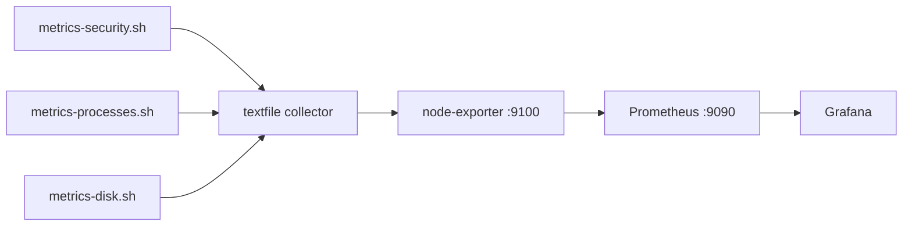

# Dashboard Guide — Nizam System

## Pipeline

| Script | Writes | Interval | Why |
|---|---|---|---|
| `metrics-security.sh` | `security.prom` | 1 min | Security events change slowly |
| `metrics-processes.sh` | `processes.prom` | 30 sec | CPU/memory change fast |
| `metrics-disk.sh` | `disk-dirs.prom` | 5 min | `du` walks entire trees — slow and I/O heavy |

All three write Prometheus-format textfiles to `/var/lib/prometheus/node-exporter/`. node-exporter scrapes that directory; Prometheus scrapes node-exporter.

## Import

Grafana and Prometheus are installed in nizam-os Step 0. Once running:

**1. Add datasource** — Grafana → Connections → Data Sources → Add → Prometheus
- URL: `http://localhost:9090`

**2. Import dashboard** — Grafana → Dashboards → Import → Upload JSON file
- File: `~/nizam-dotfiles/grafana/system-dashboard.json`
- Select the Prometheus datasource when prompted

---

## Stat tiles (top row)
Six tiles giving a live snapshot. Color = health: green is fine, orange is a warning, red needs attention.

| Tile | What it means |
|---|---|
| Uptime | Time since last boot. If this resets unexpectedly, the server rebooted. |
| CPU Usage | % of CPU in use. Above 90% = red. Normal idle should be under 20%. |
| RAM Usage | % of RAM used. Above 90% = red. Consistently there means you're close to swapping. |
| Disk Usage | % of root partition used. A full disk can crash services silently — watch this one. |
| Load Avg (1m) | Processes waiting to run. Above 2.0 on a 2-core VPS means the CPU is oversubscribed. |
| TCP Connections | Active connections right now. A sudden spike = traffic surge or a connection leak. |

## CPU & Memory
Time series over the last 6 hours.

- **CPU** — one line per core. One core pinned at 100% while the other is idle = single-threaded bottleneck.
- **Memory** — three lines: red (used), yellow (cache/buffer — reclaimed freely), green (available). Watch for red creeping up and green shrinking over time — that's a memory leak.

## Network & Disk I/O
Mirrored layout: positive = in/read, negative = out/write.

- **Network** — bytes/s in and out. Unexpected sustained inbound = unwanted traffic.
- **Disk** — bytes/s read and written to disk. Sustained writes you can't explain = runaway logging or a DB process.

## Load Average + Disk Usage by Directory
- **Load avg** — 1m (yellow), 5m (orange), 15m (red). Read them together: all three rising = sustained pressure. 1m spike with 5m/15m flat = short burst, probably a cron job.
- **Disk usage by directory** — top 5 directories stacked in one bar, total vs 102 GB disk. Each color = one directory path (legend on right). Use this to find what to clean: `/var/lib` = database data, `/var/log` = old logs, `/var/cache` = apt cache. Updated every 5 min — `du` is slow on large trees.

## Top Processes

Two bar gauges showing top 5 consumers, updated every 30 seconds.

- **Top CPU** — `%CPU` per process from `ps aux`, LCD bar style with continuous green→yellow→red scale. Bars are proportional to 100% CPU. Process name includes PID (`grafana[892]`) so multiple instances of the same binary show separately.
- **Top Memory** — RSS per process stacked in one bar, proportional to total server RAM (8 GB). Same pattern as disk — each process is a colored segment, hover to see exact sizes. `litellm/python` and `hermes-agent/python` are shown with their parent directory to distinguish multiple Python processes.

Both panels use instant queries — avoids range query returning >5 series when different processes enter the top 5 at different timestamps. `du`, `ps`, `awk`, `grep`, `sh`, and `bash` are excluded from process collection — they appear briefly at 100% CPU during collection and are not useful signal.

Grafana itself is tuned with `GOGC=20` and `GOMEMLIMIT=350MiB` (set in `/etc/default/grafana-server`) to keep its own RSS under ~350 MB. Without this, Go's runtime holds 800 MB+ of heap indefinitely.

## Security tiles
All-time counters except Currently Banned which is live.

| Tile | What it means |
|---|---|
| SSH Failed Logins | Total failed password attempts in auth.log. High total is normal on a public VPS. |
| SSH Invalid Users | Attempts using usernames that don't exist. Same — expected noise. |
| Currently Banned | IPs fail2ban has blocked right now. Goes up and down as bans expire. |
| UFW Blocked Packets | Total packets the firewall has dropped. Climbs constantly — that's normal. |

## Security Events timeline
Shows **1-hour increase** in each metric — turns flat counters into activity spikes. This is the useful one for spotting attacks. A coordinated spike across SSH failures + UFW blocks at the same time = active scan or brute-force attempt. fail2ban handles it automatically but this is how you know it happened.
